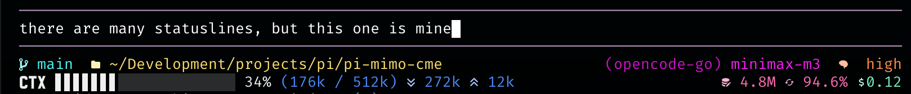
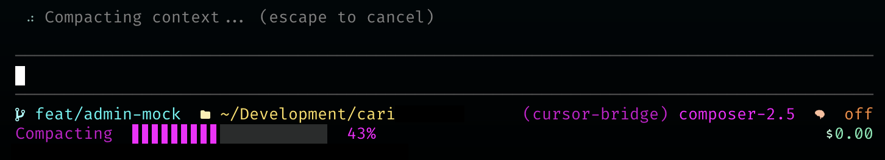

# pi-synthwave-statusline



A [Pi](https://github.com/earendil-works/pi-coding-agent) extension that replaces the default statusline with a Synthwave 84–themed footer.

## Features

### Two-line status footer

**Line 1 — Navigation & Model**
- Git branch and working directory with adaptive path trimming
- Active model and provider with thinking level indicator
- Codex-style shimmer animation on model name (triggers on `/new`, `/reload`, and model change)

**Line 2 — Context & Token Stats**
- Context usage progress bar with color-coded thresholds:
  - **White** — under 40% usage
  - **Electric cyan** — 40–69% usage
  - **Hot pink** — 70%+ usage
- Context percentage and used/total token ratio
- Input and output token counts
- Live tokens/sec during streaming (with 2s debounce after streaming stops)
- Cache read tokens and cache hit ratio
- Session cost

**Line 3 — Extension statuses** (shown when other extensions report status)

### Compaction progress

When you run `/compact`, line 2 switches from context stats to a magenta compaction progress bar:



- **Pre-phase** — starts immediately on `/compact` submit; eases exponentially to 5% over 15 seconds, then holds at 5% while Pi prepares
- **Main phase** — continues from the pre-phase percentage once compaction begins, easing toward 95% based on session size
- **Complete** — jumps to 100% when compaction finishes, then clears after a brief flash

### Color palette

All colors are drawn from the Synthwave 84 palette:
- Electric cyan for branch names and context mid-range
- Sunset yellow for directory paths
- Neon green for cost
- Bright magenta for model name
- Hot pink for cache stats and context high-range
- Burnt orange for thinking level
- Blue for token counts

### Adaptive layout

Segments degrade gracefully when the terminal is too narrow — least important segments are hidden first, keeping the most critical information visible.

## Requirements

- **[Pi](https://github.com/earendil-works/pi-coding-agent)** — the CLI coding agent this extension is built for
- **[Nerd Font](https://www.nerdfonts.com/)** — required for status icons (git branch, folder, tokens, cache, cost). Any patched Nerd Font works (e.g. JetBrainsMono Nerd Font, FiraCode Nerd Font, etc.)
- **True color terminal** — the extension uses 24-bit RGB ANSI escape codes (`\x1b[38;2;R;G;Bm`). Most modern terminals support this (iTerm2, Kitty, Alacritty, WezTerm, Windows Terminal, Ghostty)

## Installation

Copy or symlink `statusline.ts` into your Pi extensions directory:

```bash
# macOS / Linux
cp statusline.ts ~/.pi/extensions/statusline.ts
```

The extension activates automatically on the next Pi session.

## Author

Eric Sison
